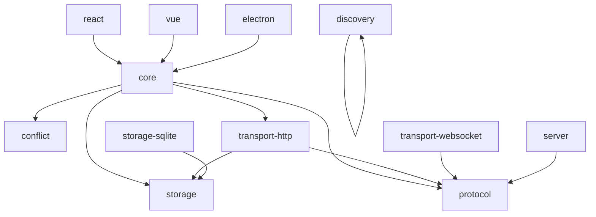

# Architecture

OfflineSync is a monorepo of 12 packages organized into four layers:
protocol, storage, core engine, and platform integrations.

## Layer Diagram

```text
┌──────────────────────────────────────────────────────────────────────┐
│                        Platform Integrations                          │
│                                                                         │
│  ┌───────────┐  ┌──────────┐  ┌───────────┐  ┌───────────────────┐ │
│  │  React   │  │   Vue    │  │  Electron  │  │      Discovery       │ │
│  │  hooks   │  │composables│  │  IPC bridge │  │  (LAN peer sync)    │ │
│  └───────────┘  └──────────┘  └───────────┘  └───────────────────┘ │
└──────────────────────────────────────────────────────────────────────┘
        │              │              │                     │
┌──────────────────────────────────────────────────────────────────────┐
│                          Core Engine                                   │
│                                                                         │
│  ┌────────────────┐  ┌──────────────────┐  ┌────────────────────────────┐   │
│  │ SyncEngine    │  │ Collection   │  │ ConflictResolutionManager  │   │
│  │               │  │ (typed CRUD) │  │ (per-collection routing)   │   │
│  └────────────────┘  └──────────────────┘  └────────────────────────────┘   │
│  ┌──────────────────────────────────────────────────────────────────────┐   │
│  │ MutationQueue  │  MutationRecorder  │  SyncScheduler            │   │
│  │ (durable)      │  (seq tracking)   │  (backoff scheduling)      │   │
│  └──────────────────────────────────────────────────────────────────────┘   │
│  ┌──────────────────────────────────────────────────────────────────────┐   │
│  │ RecoveryManager  │  IntegrityChecker  │  LifecycleManager       │   │
│  │ (crash recovery) │ (data integrity)   │ (graceful shutdown)      │   │
│  └──────────────────────────────────────────────────────────────────────┘   │
└──────────────────────────────────────────────────────────────────────┘
                            │
┌──────────────────────────────────────────────────────────────────────┐
│                       Transport Layer                                 │
│                                                                         │
│  ┌───────────────────┐      ┌───────────────────────────────┐   │
│  │ transport-http     │      │ transport-websocket                 │   │
│  │ (request/response) │      │ (bidirectional, server push)        │   │
│  └───────────────────┘      └───────────────────────────────┘   │
└──────────────────────────────────────────────────────────────────────┘
             │                                 │
┌──────────────────────────────────────────────────────────────────────┐
│                     Protocol & Storage                                 │
│                                                                         │
│  ┌──────────────┐  ┌─────────────────────┐  ┌─────────────────────┐  │
│  │   protocol   │  │   storage    │  │storage-sqlite│                 │
│  │ (wire types) │  │ (interface)  │  │ (SQLite impl)│                 │
│  └──────────────┘  └─────────────────────┘  └─────────────────────┘  │
│  ┌──────────────────────────────────────────────────────────────────────┐  │
│  │   conflict   │  │   server     │                                  │
│  │ (strategies) │  │ (ref server) │                                  │
│  └──────────────────────────────────────────────────────────────────────┘  │
└──────────────────────────────────────────────────────────────────────┘
```

## Package Dependency Graph



## Design Principles

### Zero External Runtime Dependencies (Core)

The core packages — `@offlinesync/protocol`, `@offlinesync/storage`, `@offlinesync/conflict`, and `@offlinesync/discovery` — have **zero runtime dependencies**. They are pure TypeScript with no imports from npm. This makes them tree-shakeable, auditable, and portable to any JavaScript runtime.

### Interface-Driven Design

Every major component is defined by an interface:

- `StorageAdapter` — Swap between in-memory, SQLite, IndexedDB, or any backend
- `SyncTransport` — Use HTTP, WebSocket, or implement your own
- `DiscoveryBackend` — Plug in mDNS, WebRTC, or any discovery mechanism
- `ConflictResolver` — Per-collection strategy routing

### Typed Throughout

Every collection is typed to a specific data shape `Collection<Task>`. The query builder, entity access, and change events all reflect the correct types.

## Sync Protocol

OfflineSync uses a simple request/response protocol over HTTP or WebSocket:

### Incremental Sync

1. Client sends `SyncRequest` with pending mutations and last known cursor
2. Server processes mutations, returns `SyncResponse` with:
   - `changes` — Entities that changed since the cursor
   - `acknowledgedMutationIds` — Mutations the server accepted
   - `conflicts` — Entities where server and client diverged
   - `serverCursor` — New cursor for the next sync

### Snapshot Sync

1. Client sends `SnapshotRequest` listing which collections it needs
2. Server returns `SnapshotResponse` with all entities grouped by collection

Used for initial sync and when the incremental cursor is too old.

## Transport Layer

### HTTP Transport

Simple request/response model using the global `fetch` API. Works in Node.js, Bun, Deno, Cloudflare Workers, and browsers. Each sync cycle is a single HTTP POST.

### WebSocket Transport

Bidirectional connection with server push. The server can push changes to clients in real-time without waiting for a sync cycle. Includes connection state management, version negotiation, and automatic reconnection.

## Storage Layer

### StorageAdapter Interface

The storage contract is intentionally minimal: `get`, `put`, `delete`, `query`, `transaction`, `close`. This makes it possible to implement adapters for any backend — SQLite, IndexedDB, AsyncStorage (React Native), or remote databases.

### SQLite Adapter

The built-in `SQLiteStorageAdapter` uses `better-sqlite3` for synchronous, high-performance access. It automatically creates tables, handles schema migrations, and supports atomic transactions for crash-safe writes.

### In-Memory Adapter

An `InMemoryStorageAdapter` is included for testing and development. It implements the full `StorageAdapter` interface using JavaScript Maps.

## Conflict Resolution

Conflicts are routed per-collection through the `ConflictResolutionManager`. Each collection can use a different strategy:

| Strategy | Behavior |
|---|---|
| `last-write-wins` | Compares `updatedAt`, picks the newer version |
| `server-wins` | Always accepts the server version |
| `client-wins` | Always keeps the client version |
| `field-merge` | Merges individual fields; server wins on collision |
| `operation-aware` | Uses operation type (set vs. field update) for smarter resolution |
| `manual` | Returns conflict info for application-level handling |

Custom strategies implement the `ConflictResolver` interface: `(context) => Promise<ConflictResolution>`.
